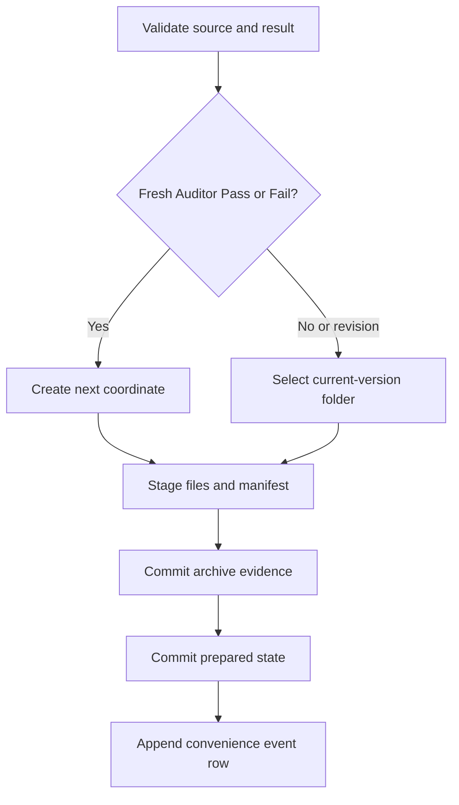
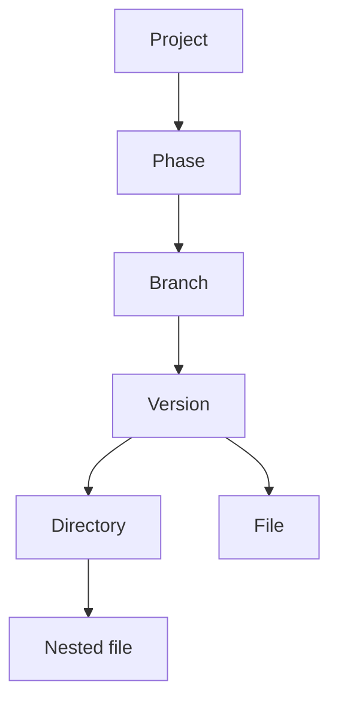

# Architecture

## Authority split

The application keeps five concerns separate:

1. `discovery.py` reads the existing phase/branch/version structure and computes unused destinations.
2. `workflow.py` owns the Operator/Guardian/Auditor state machine.
3. `archive_policy.py` grants coordinate creation only to a fresh Auditor Pass or Fail. An Auditor revision triggered by a Guardian failure is locked to the current version with every other non-authoritative return.
4. `archive.py` performs staged copies, hashes artifacts, writes authoritative manifests, and commits tracker state.
5. `search_engine.py` derives a disposable local retrieval index from project files. The search database is never authoritative project evidence.
6. `search/` captures a completed retrieval result and writes a versioned JSON observation without changing the index, archive, or workflow.

The GUI calls these modules but does not reproduce their rules.

## Archive transaction



The coordinate-creation manifest and every append-event manifest contain the full next state. The root-level state file is the fast resume pointer. A pending pointer is accepted during recovery only when its event ID matches the exact manifest named by that pending state.

## Retrieval graph



Nodes store their coordinate and filesystem path. FTS results identify direct matching nodes. The version coordinate supplies the bounded relation expansion used by **Same archived interaction**.

## Local metadata

```text
project-root/.project-handoff/
├── state.json
├── state.pending.json    # exists only during a commit or recoverable interruption
├── events.jsonl
├── search.sqlite3
└── search-exports/
    └── search-<timestamp>-<query>-<id>.json
```

`events.jsonl` is a convenience timeline. Per-version manifests remain the authoritative evidence if the event journal ever requires reconstruction.

Search exports are derived observations of a particular query and index snapshot. They are excluded from indexing, carry no workflow authority, and are never treated as archived agent evidence merely because they exist.
