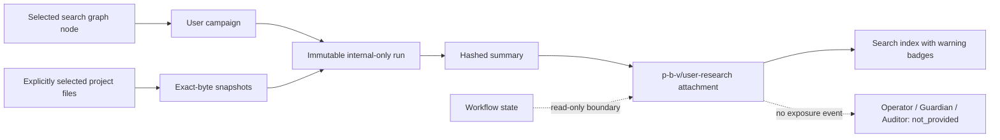
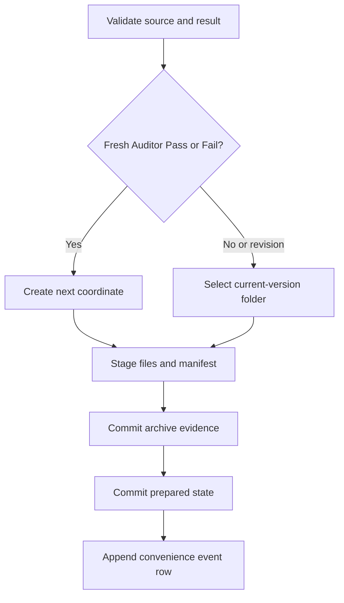
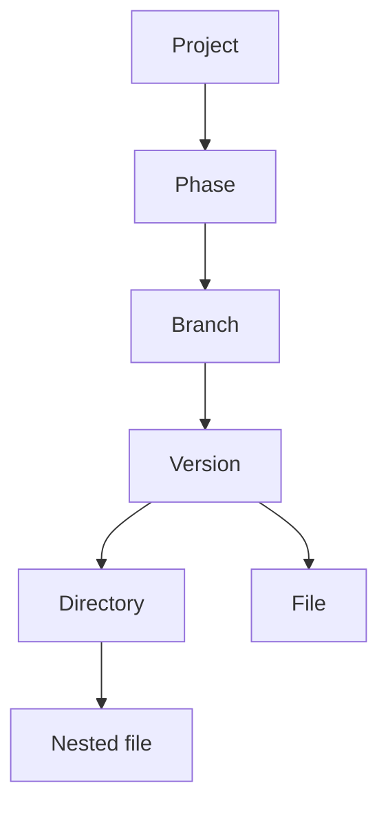

# Architecture

## Authority split

The application keeps seven concerns separate:

1. `discovery.py` reads the existing phase/branch/version structure and computes unused destinations.
2. `workflow.py` owns the Operator/Guardian/Auditor state machine.
3. `archive_policy.py` grants coordinate creation only to a fresh Auditor Pass or Fail. An Auditor revision triggered by a Guardian failure is locked to the current version with every other non-authoritative return.
4. `archive.py` performs staged copies, hashes artifacts, writes authoritative manifests, and commits tracker state.
5. `search_query.py` parses broad terms and quoted phrases. `search_engine.py` derives a disposable local retrieval index, ranks candidates with FTS5/BM25, and verifies quoted phrases against original indexed fields.
6. `search/` captures retrieval results and writes versioned JSON observations without changing the index, archive, or workflow. `search/batch.py` sequences independent query captures and adds shared batch identity and ordering metadata.
7. `workbench/` creates immutable internal research records and chronological p-b-v attachments. It has no workflow, archive, alignment, or delivery dependency.

The GUI calls these modules but does not reproduce their rules.

## Research Workbench isolation



The Workbench performs no import from `workflow.py`, `workflow_alignment.py`, `archive.py`, `archive_policy.py`, or `state_store.py`. It reads p-b-v folders through discovery, stores private run material under the control directory, and creates only `user-research/` attachment folders under project history.

Attachment and agent exposure are separate records. A Workbench attachment cannot infer provided, acknowledged, relied-on, audited, adopted, or published state. Search is also non-authoritative and cannot create an exposure event.

## Archive transaction



The coordinate-creation manifest and every append-event manifest contain the full next state. The root-level state file is the fast resume pointer. A pending pointer is accepted during recovery only when its event ID matches the exact manifest named by that pending state.

## Retrieval graph



Nodes store their coordinate and filesystem path. FTS results identify direct matching nodes. The version coordinate supplies the bounded relation expansion used by **Same archived interaction**.

## Local metadata

```text
project-root/.project-handoff/
├── state.json
├── state.pending.json    # exists only during a commit or recoverable interruption
├── events.jsonl
├── search.sqlite3
├── search-exports/
│   └── search-<timestamp>-<query>-<id>.json
├── workbench.sqlite3
└── workbench/
    ├── objects/sha256/<prefix>/<digest>
    └── runs/<run-id>/
        ├── run.json
        ├── provenance.json
        └── artifact-links.json
```

`events.jsonl` is a convenience timeline. Per-version manifests remain the authoritative evidence if the event journal ever requires reconstruction.

Search exports are derived observations of a particular query and index snapshot. They are excluded from indexing, carry no workflow authority, and are never treated as archived agent evidence merely because they exist.

`workbench.sqlite3` is an append-only metadata ledger for campaigns, runs, content objects, attachments, and future explicit exposure events. SQLite triggers reject updates and deletes for immutable Workbench records. The empty exposure ledger is intentional in this checkpoint.

The current application has no outbound package builder. `HandoffPackageExclusionPolicy` is therefore an enforced adapter contract, covered for all three roles, rather than a hidden modification to inbound archival behavior. Any future package builder must call that policy before constructing a default manifest.
